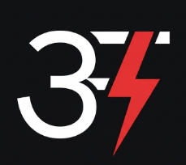

<p align="center">
  
</p>

<p align="center">
  <a href="https://github.com/K2alyan/aksharaMD/actions/workflows/ci.yml"></a>
  <a href="https://pypi.org/project/aksharamd/"></a>
  
  <a href="LICENSE"></a>
</p>

# AksharaMD

**An LLM document ingestion pipeline. Not a Markdown converter — a pre-processing layer that strips noise, preserves structure, and produces token-efficient content your LLM can actually use.**

AksharaMD takes any document — PDF, DOCX, XLSX, audio, image, archive, and 35+ more — and produces structured, token-efficient text designed to be fed directly to an LLM. The goal is not a perfect Markdown replica of the source file. The goal is to give your LLM exactly what it needs to reason over the same content while spending dramatically fewer tokens than it would on the raw file.

Feed AksharaMD instead of the raw file. Your LLM gets less noise, better structure, and the same information — for a fraction of the context cost.

Runs entirely on-device, deterministically, with no AI dependencies.

---

## Why AksharaMD

**Why not just pass the raw file?**

Every format wastes tokens in a different way: a PDF with headers, footers, watermarks, and scanned pages; a DOCX with revision history and embedded metadata; an XLSX with thousands of empty cells. AksharaMD strips all of that before your LLM ever sees it. What remains is the content — structured by heading, table, and code block — at a fraction of the original token cost.

The output is not meant to be a beautiful document. It is the minimum viable text an LLM needs to answer questions, extract data, or summarise — with an AI Readiness Score so you know when the extraction is reliable enough to use.

- **15× fewer tokens than [MarkItDown](https://github.com/microsoft/markitdown)** on equivalent documents — measured across 23 format types
- **98.5% less noise** — 3.7 avg noise lines vs 250.1 for MarkItDown
- **27× faster than [Docling](https://github.com/DS4SD/docling)** on PDF with higher extraction quality
- **Structured output** — emits real headings, tables, code blocks; MarkItDown produces flat text
- **AI Readiness Score** — every compilation returns a 0–100 confidence score so you know what you're working with
- **No ML dependencies** — fast, memory-efficient, and fully reproducible

---

## Quickstart

Requires **Python 3.11 or later**.

```bash
pip install aksharamd
aksharamd compile report.pdf
aksharamd validate report.pdf
aksharamd formats
```

Output is written to `output/report/`:

```
output/report/
├── document.md       # compiled Markdown
├── document.json     # structured block model
├── manifest.json     # token counts, timings, readiness score
├── validation.json   # extraction issues
└── chunks/           # semantic chunks as JSON
```

**Scanned PDFs** (requires Tesseract 5+ installed at the system level — `pip install` alone is not enough):

```bash
pip install "aksharamd[ocr]"
# Install Tesseract 5+ separately: https://github.com/tesseract-ocr/tesseract
# Make sure the tesseract binary is on your PATH, then:
aksharamd compile scanned.pdf
```

**Claude Desktop (MCP):**

```bash
aksharamd mcp-config --write
# Restart Claude Desktop — AksharaMD will appear in the tools panel
```

---

## Installation

```bash
# Standard install
pip install aksharamd

# With image OCR (requires Tesseract — see below)
pip install "aksharamd[ocr]"

# With audio transcription (requires ffmpeg on PATH)
pip install "aksharamd[audio]"

# Everything
pip install "aksharamd[full]"
```

To install from source:

```bash
git clone https://github.com/K2alyan/aksharaMD.git
cd aksharaMD
pip install -e .
```

**Optional system dependencies:**

| Feature | Requirement |
|---------|-------------|
| Image OCR | [Tesseract 5+](https://github.com/tesseract-ocr/tesseract) binary on PATH, then `pip install pytesseract` |
| Audio transcription | [ffmpeg](https://ffmpeg.org) on PATH, then `pip install openai-whisper` |
| Legacy Office (`.doc`, `.ppt`) | [LibreOffice](https://www.libreoffice.org) on PATH |
| Pandoc | [Pandoc](https://pandoc.org/installing.html) binary on PATH — enables AsciiDoc, Org-mode, Textile, MediaWiki, DocBook, man/roff, and OPML |

---

## Known Limitations

The core pipeline is stable and production-tested across 118 file extensions, but please note the following before using in production workflows.

**OCR for scanned PDFs requires a system binary.**
`pip install "aksharamd[ocr]"` installs the Python wrapper (`pytesseract`) but not Tesseract itself. You must also install [Tesseract 5+](https://github.com/tesseract-ocr/tesseract) at the OS level and make sure the `tesseract` binary is on your `PATH`. Without it, scanned pages produce a POOR score and an `OCR_REQUIRED` warning.

**Complex PPTX layouts are supported but experimental.**
Standard slide content, bullet points, and embedded tables extract reliably. Complex animations, heavily layered slide masters, and custom layout templates may produce incomplete output.

**Outlook `.msg` parsing is lower-confidence than EML/DOCX/PDF.**
The `.msg` format is a proprietary binary container. Body text and attachments extract correctly in most cases, but embedded calendar objects, rich-text encoding edge cases, and S/MIME-signed messages may not parse completely.

**Windows: prefer Windows Terminal or PowerShell 7.**
Legacy `cmd.exe` uses the cp1252 code page, which cannot render some Unicode characters used in the CLI output (e.g. box-drawing lines from Rich). Run AksharaMD in [Windows Terminal](https://aka.ms/terminal), VS Code's integrated terminal, or PowerShell 7. Setting `PYTHONUTF8=1` also resolves most encoding issues.

**`mcp-config --write` creates an automatic backup.**
Before overwriting your Claude Desktop config, AksharaMD saves a timestamped copy (e.g. `claude_desktop_config.1720123456.bak.json`) in the same directory. No data is lost, but you may want to clean these up manually after confirming the new config works.

---

## CLI Reference

### `compile`

Compile a document or URL into Markdown, JSON, and semantic chunks.

```bash
aksharamd compile <source> [options]
```

| Option | Default | Description |
|--------|---------|-------------|
| `-o`, `--output` | `output` | Output directory |
| `--timings` | — | Show per-stage timing breakdown |
| `--quiet` | — | Suppress all console output |
| `-v`, `--verbose` | — | Enable debug logging |

**Examples:**

```bash
# Compile a local file
aksharamd compile report.pdf

# Specify output directory
aksharamd compile report.pdf -o compiled/

# Compile a URL
aksharamd compile https://arxiv.org/pdf/2301.00001

# Show timing breakdown
aksharamd compile report.pdf --timings

# Suppress output (for scripting)
aksharamd compile report.pdf --quiet
```

### `validate`

Validate extraction without writing output files.

```bash
aksharamd validate report.pdf
aksharamd validate https://example.com/doc.pdf
```

Exits `0` on success, `1` if validation errors are found.

### `benchmark`

Compile multiple files and compare them side by side.

```bash
aksharamd benchmark doc1.pdf doc2.docx doc3.html
```

### `stats`

Show cumulative token savings across all compilations.

```bash
aksharamd stats
aksharamd stats --reset    # clear the ledger
```

### `show-manifest`

Print the manifest from a previous compilation.

```bash
aksharamd show-manifest output/report/
```

### `corpus`

Compile every supported file under a directory into token-budget-bounded chunks, with automatic near-duplicate detection.

```bash
aksharamd corpus <source_dir> [options]
```

| Option | Default | Description |
|--------|---------|-------------|
| `-o`, `--output` | — | Write chunks to a JSON file |
| `--budget` | `60000` | Maximum tokens per chunk |
| `--dedup-threshold` | `0.5` | Jaccard similarity threshold for near-duplicate skipping |

```bash
aksharamd corpus ./documents/ --budget 8000 -o corpus.json
```

### `mcp-config`

Generate and apply the MCP server configuration for Claude Desktop.

```bash
aksharamd mcp-config           # print config to copy manually
aksharamd mcp-config --write   # write directly to Claude Desktop config
```

### `formats`

List all registered parsers and supported extensions.

```bash
aksharamd formats
```

---

## Python API

### Compile to string

Compile a document without writing any files to disk.

```python
from aksharamd.compiler import Compiler

compiler = Compiler(output_dir="output")
text, ctx = compiler.compile_to_string("report.pdf")

print(text)                                       # compiled Markdown
print(ctx.manifest.optimized_tokens)             # token count after optimisation
print(ctx.manifest.token_reduction_percent)      # % reduction vs raw
print(ctx.manifest.readiness_score)              # confidence 0–100
print(ctx.manifest.elapsed_seconds)              # wall-clock time
```

### Full compilation (writes to disk)

```python
ctx = compiler.compile("report.pdf")
# Output written to output/report/document.md, manifest.json, etc.
```

### Compile from URL

```python
text, ctx = compiler.compile_to_string("https://arxiv.org/pdf/2301.00001")
```

### Stream blocks incrementally

Process blocks as they are extracted and optimized, without waiting for the full document. Useful for feeding a RAG index, vector store, or any pipeline that can act on individual blocks.

```python
from aksharamd.compiler import Compiler
from aksharamd.models.block import BlockType

compiler = Compiler()

for block in compiler.stream("report.pdf"):
    if block.type == BlockType.TABLE:
        index_table(block.content)
    elif block.type == BlockType.PARAGRAPH:
        embed_and_store(block.content)
```

`stream()` runs detect → parse → clean → optimize and yields each `Block` in document order. Validate, chunk, manifest, and export stages are skipped — use `compile()` when you need those.

### Multimodal output (images inline)

Returns an Anthropic-compatible content array with text and base64 images interleaved at their document positions.

```python
content, ctx = compiler.compile_to_multimodal("report.pdf")

# Pass directly to the Anthropic API
response = anthropic_client.messages.create(
    model="claude-opus-4-7",
    max_tokens=4096,
    messages=[{"role": "user", "content": content + [{"type": "text", "text": "Summarise this."}]}],
)
```

### Compilation context

The `ctx` object returned by all compile methods exposes:

| Attribute | Type | Description |
|-----------|------|-------------|
| `manifest.source` | `str` | Source file path or URL |
| `manifest.file_type` | `str` | Detected format |
| `manifest.pages` | `int` | Page or section count |
| `manifest.original_tokens` | `int` | Raw token estimate |
| `manifest.optimized_tokens` | `int` | Tokens after pipeline |
| `manifest.token_reduction_percent` | `float` | Reduction percentage |
| `manifest.readiness_score` | `int` | Extraction confidence 0–100 |
| `manifest.elapsed_seconds` | `float` | Wall-clock time |
| `manifest.tables` | `int` | Tables extracted |
| `manifest.chunks` | `int` | Semantic chunks produced |
| `validation.errors` | `list` | Extraction errors, if any |
| `validation.warnings` | `list` | Non-fatal issues |
| `document.blocks` | `list[Block]` | Structured block model |

---

## MCP Server

AksharaMD ships an [MCP](https://modelcontextprotocol.io) server that exposes the compilation pipeline as tools for any MCP-compatible host — Claude Desktop, Cursor, and others.

### Setup

Run this once after installation:

```bash
aksharamd mcp-config --write
```

This detects your Python environment, generates the correct configuration, and writes it directly into your Claude Desktop config file. Restart Claude Desktop — AksharaMD will appear in the tools panel.

To preview the config before writing:

```bash
aksharamd mcp-config
```

### Tools available in Claude

| Tool | Description |
|------|-------------|
| `compile_document` | Compile any file or URL into clean Markdown |
| `compile_document_multimodal` | Compile with charts and diagrams returned inline |
| `get_supported_formats` | List all supported formats and optional dependencies |
| `get_stats` | Lifetime token savings across all compilations |

### HTTP mode (server deployments)

For deployments where Claude connects over the network rather than launching a local process:

```bash
AKSHARAMD_MCP_API_KEY=your-secret-key \
AKSHARAMD_ALLOWED_ROOT=/path/to/allowed/documents \
aksharamd-mcp --transport streamable-http --host 0.0.0.0 --port 8000
```

`AKSHARAMD_ALLOWED_ROOT` restricts which directories the server can read from. `AKSHARAMD_MCP_API_KEY` requires clients to send an `X-API-Key` header with every request. Both are optional in local stdio mode but strongly recommended in HTTP mode.

---

## Ecosystem

AksharaMD operates as a **document ingestion layer** — it handles format conversion, noise removal, deduplication, and semantic chunking so that downstream tools receive clean, structured text. It integrates naturally with the following systems.

### LangChain

Replace LangChain's built-in document loaders (`PyPDFLoader`, `UnstructuredFileLoader`, and others) with AksharaMD's extraction pipeline. The output maps directly to `langchain_core.documents.Document` and supports the full range of 40+ formats LangChain loaders do not cover.

```python
from aksharamd.compiler import Compiler
from langchain_core.documents import Document

compiler = Compiler()
text, ctx = compiler.compile_to_string("report.pdf")

doc = Document(
    page_content=text,
    metadata={
        "source": ctx.manifest.source,
        "file_type": ctx.manifest.file_type,
        "readiness_score": ctx.manifest.readiness_score,
    },
)
```

### LlamaIndex

Use AksharaMD as a document reader ahead of LlamaIndex's indexing and retrieval pipeline, replacing `SimpleDirectoryReader` for higher-fidelity extraction on complex formats.

```python
from aksharamd.compiler import Compiler
from llama_index.core import Document, VectorStoreIndex

compiler = Compiler()
text, ctx = compiler.compile_to_string("report.pdf")

index = VectorStoreIndex.from_documents([
    Document(text=text, metadata={"source": ctx.manifest.source}),
])
```

### Vector stores (ChromaDB, Pinecone, Weaviate, Qdrant)

`compile_corpus()` walks a directory, deduplicates near-identical documents via MinHash LSH, and returns token-budget-bounded chunks ready for embedding and upsert. The `token_budget` parameter should be set to match your embedding model's context window.

```python
from aksharamd.compiler import Compiler

compiler = Compiler()
chunks = compiler.compile_corpus("./documents", token_budget=8_000, dedup_threshold=0.8)

for chunk in chunks:
    texts  = [doc["text"]   for doc in chunk["documents"]]
    ids    = [doc["source"] for doc in chunk["documents"]]
    collection.add(documents=texts, ids=ids)
```

Each chunk carries a `confidence` breakdown (`extracted`, `inferred`, `ambiguous` block counts) that can be stored as metadata and used to filter retrieval results by extraction quality.

### Graphify

AksharaMD is designed to function as a preprocessing layer ahead of knowledge graph construction pipelines such as [Graphify](https://github.com/safishamsi/graphify). Graphify expects coherent text passages as input; AksharaMD handles the upstream problem of extracting that text from arbitrary document formats, including scanned PDFs, archives, and legacy Office files.

The two tools share the same MinHash signature family (Mersenne-prime universal hashing), so near-duplicate detection applied at the AksharaMD stage does not need to be repeated downstream.

```python
from aksharamd.compiler import Compiler

compiler = Compiler()
chunks = compiler.compile_corpus(
    "./documents",
    token_budget=60_000,  # size chunks to Graphify's preferred context window
    dedup_threshold=0.8,
)

for chunk in chunks:
    combined_text = "\n\n---\n\n".join(doc["text"] for doc in chunk["documents"])
    graph_builder.ingest(combined_text)
```

---

## Supported Formats

| Category | Extensions |
|----------|------------|
| Text and markup | `.md` `.txt` `.rst` `.tex` `.html` `.htm` |
| Documents | `.pdf` `.docx` `.pptx` `.xlsx` `.odt` `.ods` `.odp` `.epub` `.rtf` |
| Legacy Office | `.doc` `.ppt` `.xls` *(requires LibreOffice on PATH)* |
| Data | `.json` `.jsonl` `.csv` `.tsv` `.xml` `.yaml` `.toml` |
| Email | `.eml` `.msg` |
| Notebooks | `.ipynb` |
| Source code | `.py` `.js` `.ts` `.go` `.rs` `.java` `.c` `.cpp` `.sql` `.sh` and 30+ more |
| Images (OCR) | `.jpg` `.jpeg` `.png` `.tiff` `.bmp` `.webp` `.gif` *(requires Tesseract)* |
| Audio | `.mp3` `.wav` `.m4a` `.ogg` `.flac` *(requires Whisper + ffmpeg)* |
| Archives | `.zip` `.tar` `.tgz` `.gz` `.bz2` `.xz` `.7z` |
| Feeds | `.rss` `.atom` |

---

## Benchmarks

These are two independent studies. The first measures token efficiency and speed on a small internal corpus. The second measures whether token savings actually produce better LLM answers, using a larger independent corpus with an LLM judge.

---

### Study 1 — Token efficiency and speed

**Corpus:** 101 documents across 23 format types (internal production corpus, June 2026). The PDF sub-table uses a 20-document arXiv / technical-report subset where Docling was also evaluated.

#### PDF (20 documents — arXiv papers, technical reports)

| Metric | AksharaMD | MarkItDown | Docling |
|--------|-----------|------------|---------|
| Avg tokens | **12,608** | 24,506 | 15,049 |
| Quality score | **94.1** | 92.8 | 93.0 |
| Avg time | **1.09s** | 1.64s | 29.96s |

AksharaMD is **27× faster than Docling** on PDF with comparable quality and **49% fewer tokens than MarkItDown**.

#### All formats (101 documents, 23 types)

| Metric | AksharaMD | MarkItDown |
|--------|-----------|------------|
| Avg tokens | **21,199** | 331,171 |
| Avg noise lines | **3.7** | 250.1 |
| Avg time | 1.40s | 0.48s |
| Format types covered | **23** | 16 |

AksharaMD produces **15× fewer tokens** and **98.5% less noise** across the full corpus. MarkItDown is faster on simple formats; AksharaMD is slower due to deeper extraction (structure detection, deduplication, chunking).

#### Per-format quality scores

| Format | AksharaMD | MarkItDown |
|--------|-----------|------------|
| HTML | **98.2** | 93.4 |
| JSON | **98.8** | 43.5 |
| RSS / ATOM | **95.1** | 93.6 |
| CSV | **93.8** | 80.0 |
| XLSX | 80.0 | 80.0 |
| PPTX | 72.5 | 81.0 |

Formats with exclusive support (MarkItDown does not handle): `.zip`, `.tar`, `.7z`, `.jsonl`, `.xml`, `.rss`, `.atom`, `.eml`, `.rtf`, `.ipynb`, `.odt`, `.ods`, `.odp`, legacy Office via LibreOffice.

---

### Study 2 — Downstream LLM accuracy

**Corpus:** ~1,000 documents across 12 formats (83 per format) — a separate, independent dataset from Study 1.

Token efficiency is necessary but not sufficient — cleaner extraction only matters if it produces better LLM answers. We tested this with a stratified corpus spanning the full complexity range found in enterprise workloads. Documents were selected across three tiers — following the taxonomy used in document AI benchmarks such as [DocBank](https://github.com/doc-analysis/DocBank) and [PubLayNet](https://github.com/ibm-aur-nlp/PubLayNet):

| Tier | Description | Example formats |
|------|-------------|-----------------|
| **Simple** | Single-column prose, minimal formatting | Plain text, CSV, JSON, email |
| **Structured** | Multi-section with tables and embedded elements | DOCX, XLSX, PPTX, EPUB |
| **Complex** | Layout-intensive, mixed media | Multi-column academic PDFs, Jupyter notebooks, mixed-format archives |

Each document received 4 factual questions, independently answered by all 5 tools and scored 0–10 by Claude Haiku 4.5 as judge (19,920 graded answers total). No tool-specific prompt tuning was applied.

| Tool | Avg score | Avg tokens | Formats covered |
|------|:---------:|:----------:|:---------------:|
| **AksharaMD** | **9.5/10** | **6,272** | **12/12** |
| [MarkItDown](https://github.com/microsoft/markitdown) | 8.6/10 | 27,449 | 12/12 |
| [Docling](https://github.com/DS4SD/docling) | 8.6/10† | 35,461 | 8/12 |
| [PyMuPDF4LLM](https://pymupdf.readthedocs.io/en/latest/pymupdf4llm/) | 8.0/10† | 34,231 | 8/12 |
| [LlamaParse](https://github.com/run-llama/llama_parse) | 7.8/10 | 26,274 | 12/12 |

† Accuracy measured on supported formats only (EML, IPYNB, JSON, and XML are unsupported by Docling; EML, IPYNB, CSV, and JSON are unsupported by PyMuPDF4LLM).

AksharaMD uses **76–82% fewer tokens** than every competing tool while leading on accuracy — and is the only tool that handles all 12 format types. At 100,000 documents/month, that translates to **$1,600–$2,335 in saved API spend** (Claude Haiku 4.5 pricing).

### Self-hosted model throughput

Token savings compound on self-hosted models. KV-cache VRAM is the binding constraint on concurrent request capacity, and prefill attention FLOPs are O(n²) in sequence length.

| Deployment scenario | AksharaMD | MarkItDown | Throughput gain |
|---------------------|:---------:|:----------:|:---------------:|
| 8B int4 · RTX 4090 (24 GB) | **25** concurrent | 5 concurrent | **5.0×** |
| 70B int4 · A100 80 GB | **20** concurrent | 4 concurrent | **5.0×** |

MarkItDown's average context takes **~19× longer to prefill** than AksharaMD's on the same GPU — the difference between a 0.3-second and a ~6-second time-to-first-token.

For the full methodology, per-format scores, cost tables, self-hosted throughput analysis, and reproduction instructions, see [`benchmarks/LLM_QA_BENCHMARK.md`](benchmarks/LLM_QA_BENCHMARK.md).

---

## Architecture

```
detect → parse → clean → optimise → validate → chunk → tokenise → manifest → score → export
```

Each stage receives and returns a `CompilationContext` object. Stages are independently pluggable.

```
aksharamd/
├── compiler.py          # Orchestrates the 10-stage pipeline
├── context.py           # CompilationContext — shared state across stages
├── cli.py               # Click-based CLI (compile, validate, benchmark, corpus, stats, mcp-config)
├── mcp_server.py        # FastMCP server (4 tools)
├── ledger.py            # Persistent savings ledger (~/.aksharamd/ledger.jsonl)
├── scoring/
│   └── readiness.py     # Extraction confidence scoring (0–100)
├── models/              # Pydantic v2 models (Manifest, Document, Block, Chunk, Asset)
└── plugins/
    ├── parsers/         # Format-specific extractors (40+ formats)
    ├── cleaners/        # Deduplication, noise removal, whitespace normalisation
    ├── optimizers/      # Token reduction passes
    ├── chunkers/        # Semantic chunking
    ├── exporters/       # Markdown and JSON serialisation
    └── validators/      # Schema and content validation
```

**Plugin registration** uses side-effect imports — parsers register themselves at module load time. Adding a new format requires only a class and a `register_parser("ext", MyParser)` call.

---

## Known Limitations

These are current boundaries of the system. They are not bugs.

**Scanned / image-heavy PDFs.** AksharaMD applies Tesseract OCR to image pages, but complex multi-column layouts, rotated text, or low-resolution scans will produce lower-fidelity output than vision-LLM approaches ([olmOCR](https://github.com/allenai/olmocr), [Docling](https://github.com/DS4SD/docling) with VLM mode). If your corpus is primarily scanned documents, evaluate carefully.

**Legacy Office formats (`.doc`, `.ppt`).** Parsing requires LibreOffice on the system PATH for format conversion. If LibreOffice is absent, these files are rejected with a clear error. `.docx`, `.pptx`, and `.xlsx` have no such dependency.

**Audio transcription.** Quality depends on the Whisper model size (`base` by default). Set `AKSHARAMD_WHISPER_MODEL=large-v3` for higher accuracy at the cost of speed. Requires ffmpeg.

**Large files.** Files above 500 MB are rejected by default. Raise the limit with `AKSHARAMD_MAX_FILE_BYTES` if needed.

**No MCP streaming.** The CLI shows a live progress spinner and `Compiler.stream()` yields blocks incrementally for programmatic callers (RAG indexing, pipelines). The MCP `compile` tool still returns the full document atomically — SSE block streaming for MCP consumers is on the roadmap.

**No structured logging.** Log output is plain text. Per-request trace IDs, JSON-formatted logs, and Prometheus metrics (request count, latency histograms, token savings counters) are on the roadmap for the HTTP MCP server deployment path.

**Complex multi-row table headers.** Financial tables with merged cells or multi-row headers may produce column name artefacts (`Col1`, `Col2`). The table content is preserved; only the header row is affected.

---

## Contributing

Bug reports and pull requests are welcome. Please open an issue first to discuss significant changes.

---

## License

[PolyForm Noncommercial 1.0.0](LICENSE) — free for personal and non-commercial use. For commercial licensing inquiries, please open an issue in this repository.
